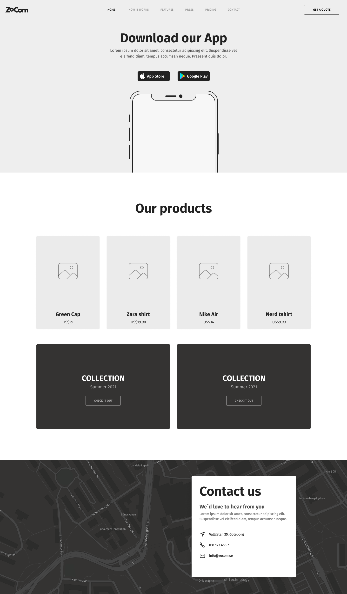

# Layout Exercise

Skapa följande mock i HTML ocs CSS.

Blocka upp sidan enligt `block > container > element`. 

Var _noga med semantiken_ och lös det med _så lite_ HTML som möjligt.

Var också noga med indenteringen av källkoden så att webbsidans DOM-träd även illustreras i källkoden.

Om ni ger klasser var noga med att klassnamnen är tydliga och beskrivande.

Click to show mockup

